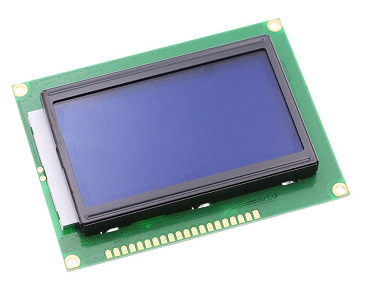
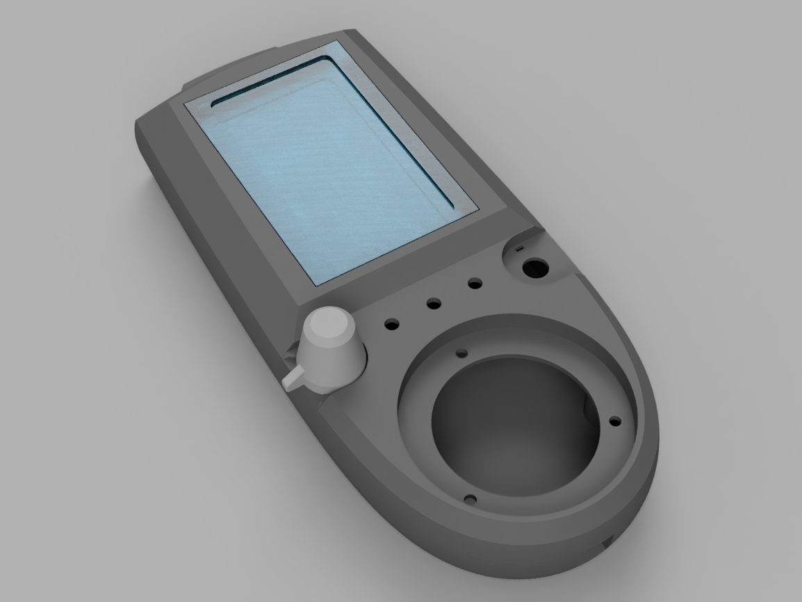

# ESPendant: A CNC Pendant That Is Also An Octoprint

# Intro 

Videos:

image:https://img.youtube.com/vi/pOqXPnl2YR0/mqdefault.jpg[link=https://youtu.be/pOqXPnl2YR0]
image:https://img.youtube.com/vi/225_HLAfdsI/mqdefault.jpg[link=https://www.youtube.com/watch?v=225_HLAfdsI]

I have a Creality Ender 3 3D printer and when I need to print anything, I constantly have to pull SD card from the printer, stick it into PC, copy files, pull from PC, stick into printer, wash, rinse, repeat. 
That operations add add mechanical wear to uSD cards, slots, not to mention they  waste time and take some fun away from 3D printing.
I've tried Octoprint and a Raspberry Pi connected to a printer, but 1) there is no control over Octoprint without connected PC (and I want autonomous printing) and 2) it boots for almost a minute!

Also, I have a chineese 3018 CNC device with a laser, for which I need a CNC pendant for manually moving laser to stock zero position.
This might be solved via a joystick and specialized PC software (since my CNC jobs are short and connecting PC is not problem), but having a CNC pendant felt way cooler.

So I started this project to make follwoing usecases possible:

* Connect a pendant to 3D printer, upload files to it over WiFi, then print autonomously, without the need for PC. Usual Marlin-level interface should be available for Z-babystepping, feedrate adjustment, pause/stop, filament change etc.
** 3D printer firmware: Marlin.
** Bonus: octoprint interface for controlling the print from PC.

* Connect a pendant to a CNC machine for DRO (digital read-out), easy jogging, setting center of working coordinates. Then either upload a file via WiFi and machine from pendant, or send gcode via WiFi to machine via pendant.
** CNC firmware: GRBL.

* Bonus: Bluetooth serial prifile for gcode streaming.

This project is inspired by https://github.com/probonopd/WirelessPrinting[WirelessPrinting] (3D printing part), 
https://github.com/drandrewthomas/ESP32_GRBL_CNC_Wireless_Pendant[ESP32 GRBL Wireless Pendant] (CNC part) with some ideas from https://github.com/cncjs/cncjs[cncjs].

The full project consists of a ESP32 firmware, a rudimentary schematic for electronics and a case. 

This repo contains the firmware sourcecode.
It written with Arduino framekwork, to be built by PlatformIO system.
This is for ease of adoption of the project by a community. 

The electronics would use widely available cheap components, schematic would be created _ad-hoc_, no complex circuitry is expected.

The case is modeled in Fusion 360 and will be published on thingiverse once prototypes are working.

## Features and specification:

* [x] Connection to device via UART.
  UART speed is autodetected at start, as it the type of firmware (Grbl/Marlin)
  I've considered USB in USB-host mode, but it requires battery circuitry since printer won't power the pendant via USB.
  I am also considering an RS232 converter as bare UART isn't going very well via long cables 
  (Had 1 bit flipped in several minute print. Need more testing)

* [x] Autodetection of device firmware: Marlin/grbl. Correct answer to M115 is expected for Marlin, and answer of $I for Grbl.

* [x] uSD card for storing files. 
  In future, configuration will also be stored there

* [x] WiFi
** [x] Uploading files to ESP32 from PC
** [x] Octoprint interface, works with Cura (3.6).
** [x] Rudimentary Web interface to upload, download, start prints.
** [x] Direct TCP/IP to UART bridge

* [x] User interace (quick'n'dirty implementation works)
** LCD, Jog wheel, buttons, axis selector, multiplier selector
** 2 main UI modes:
*** [ ] Jogging and DRO. Almost finished for Grbl
*** [x] Printing from a file. Includes a file browser and printing status window a-la Marlin LCD interface.

* [ ] Settings window for connecting to a WiFi network etc.
  This idea might be dropped since entering WiFi password would be a pain.

# BOM

* ESP32 module. 
  I used Lolin32 board. NodeMCU and Lolin D32 should work as well
* An encoder handwheel. 
  I used a 3D-printed wheel on top of a popular 30 ppr quadrature encoder. 
  Handwheel can be dwnloaded here: https://www.thingiverse.com/thing:4539825
  Commercial handwheels will work even better. 
* 2 potentiometers (20K) as jog axis selector and jog multiplier selector. 
  Clicking apparatus added via 3D-printed knobs.
* 128x64 LCD based on ST7920 chip with SPI interface. 
  It's the same as in 3D printers.
  

* MicroSD slot (I used a shield for Wemos D1 Mini boards, but any will do)
* Buttons (I have not decided on quantity yet)
* 2 resistors or level shifter for 5V UART
* Might be needed: level shifter for 5V LCD, diode+resistor for LCD SPI bugfix
* wires, cable, connector for 3D printer and CNC boards 

* Case.
  Building of the case, with 3D files, is described here
  https://www.thingiverse.com/thing:4539827

# Notes

 * (27.07) Surprisingly, at 60mm/sec prints Ender-3 does not require increasing of buffer sizes, as reported by many Octoprint users.
Those must be Octoprint issues (since it's python) or they appear only at much higher speeds than my stock 60 mm/s.
So, this project successfully manages to keep Marlin's buffers busy. 
Someone else would need to test faster prints, but I believe that UART would not be the bottleneck. 
I've extracted UART to a separate freeRTOS task, so it's not dependant on other functions (except SD card reading which is done in main loop for now)
 * (20.08.20) There are 2 conceptual issues that I am yet to find a solution for. 
 1. Progress of file printing tracks how many lines of code were read from file, not how much was acknoledged by the device. 
 There should be a way to notify the sender (Job class) of lines accepted by the device (GCodeDevice class). 
 The problem is that there could be (and are) many senders of gcode (DRO and TCP bridge alsosend gcode) and GCodeDevice needs to track what line of code comes from where.
 Some programs (LaserGRBL) overcome this altogether by simply disabling other senders (DRO) while printing is in progress.
 This should be thought through since live DRO in this project is done via GCodes for marlin (and GRBL realtime commands for GRBL) so they cannot be disabled.
 2. TCP passthrough bridge needs to be passed raw to the device. 
 Waiting for newline does not work with GRBL realtime commands that do not end with newlines.
 This must somehow bypass the whole sending queue. At the moment, TCP handling code accesses underlying `Serial` object directly, which is not good.
